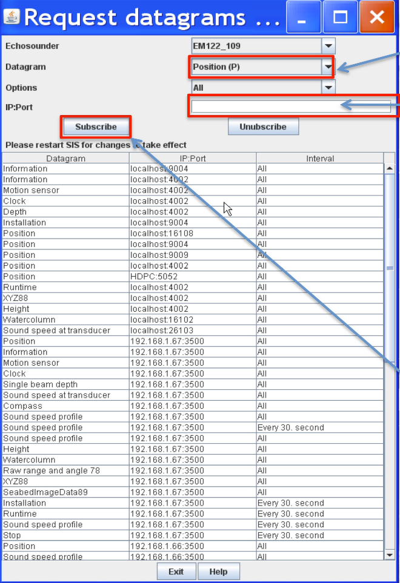

**************
How to install
**************

* the simplest way::

    pip install hydroffice.base

* for the latest features::

    hg clone ssh://hg@bitbucket.org/ccomjhc/hyo_base

Suggested configurations
========================

Given its specific aim, this hydro-package is usually installed to run in one of two configurations:

On the machine used for sound speed profile acquisition
-------------------------------------------------------

This represents a quite common choice since many of the operations accomplished in the software are typically done
immediately after acquisition of a cast. If the machine is on the same network as the multibeam acquisition workstation,
the SSP can be directly delivered via network.
When this is not possible, the package can export the processed data to files that can then be manually uploaded
to the multibeam workstation.

On the multibeam acquisition workstation
----------------------------------------

This configuration is particularly useful when it is anticipated that the software will run in Server Mode.
In fact, it is important that multibeam watch standers are able to monitor the server and to disable it
in the event that a measured profile is to be uploaded.

Upgrading
=========

You will need to migrate specific configuration settings from your previous installation over
into the new configuration file. The migration of configuration settings is currently done manually.

Space requirements
==================

Approximately 2GB of additional disk space is required for the WOA09 data set optionally required
(but warmly suggested) by this hydro-package. If not available, the package will attempt to download it.
Alternatively, it is also possible to manually download, unpack the WOA09 data set, and modify the configuration file
to point to the correct path (see :ref:`package_configuration`).

.. _package_configuration:

Package configuration
=====================

In the hydro-package project folder, you can find a configuration file: ``__config__.db``.
This SQLite database file has to be modified to reflect the chosen software deployment and environment-specific
configuration settings (e.g., the SIS IP address and ports).

Use the `SSP Settings <https://bitbucket.org/ccomjhc/hyo_ssp_settings>`_ application to modify the available
configuration options.

SSP-SIS interaction
===================

In order to automatically interact with *Kongsberg SIS*, some initial configuration are required on the *SIS* side
to make it to broadcast a specific subset of datagrams that can then be interpreted by the *SSP* hydro-package
(identification codes in parentheses):

* **Position** (‘P’, 80, 0x50): for retrieving current date and position

* **Sound Speed Profile** (‘U’, 85, 0x55): checking whether a SSP transmission was successful

* **XYZ88** (‘X’, 88, 0x58): to retrieve:

  * The surface sound speed (used in beam forming and steering) and the transducer draft (both used when augmenting SSPs with the measured surface sound speed value).
  * The depth (to estimate the approximate water depth). This is used in the sound speed, temperature and salinity plots to help the user appreciate the minimal depth to which the profiles should be extended.

*Kongsberg SIS* can be configured to broadcast datagrams in different ways:

.. _method_1:

Method #1
---------

This method is usually used for the case where the hydro-package and *SIS* are installed on the same machine.
However, since the *User Defined UDP* port cannot be modified, this method may not be suitable if this mechanism is
already in used by another program.
In such a case, the *DataDistrib.exe* program explored in :ref:`method_3` may be attempted.

The configuration for this method is actually quite simple:

* Stop pinging
* Access the *Installation Parameters* dialog (see :ref:`method_1_fig`) from the *View* menu by choosing *Tear off* and then *Installation Parameters*

.. _method_1_fig:

    Figure - *SIS Installation parameters* dialog, with key settings in red for :ref:`method_1`.

* Select the *PU Communication Setup* tab and then choose the *Output Setup* sub-tab.
* Choose *User Defined* from the *UDP Host Port* dropdown menu (the default output port varies with the MBES model). Take a note of this for configuring SSP Manager later.
* Select the following datagrams: *Depth*, *Position*, and *Sound Speed Profile*.
* Click the *OK* button at the top left of the tabbed panels.
* Restart pinging.

.. _method_2:

Method #2
---------

This method is more general, and it can be used for data transmission to other computers on the network
(by specifying IP address and port, as well as transmission rate).

.. note:: *SIS* needs to be restarted for the changes to take effect. Furthermore, since the software does not seem
          to validate user inputs, mistakes made cannot be easily discovered and undone (unsubscribe).

* From the *Tools* menu, choose *Custom…* and then *Datagram Distribution* (see :ref:`method_2_fig`).

.. _method_2_fig:

    Figure – Datagram Distribution dialog, with key settings in red for :ref:`method_2`.

* Choose the datagram from the drop down menu, starting with *Position (P)*.
* Type in the IP address of the remote machine where this hydro-package is installed, immediately followed by a colon (:), then  the port number that the data should be delivered to on the remote machine: e.g., ``192.168.1.67:16103``.
* Click the *Subscribe* button.
* Repeat Steps 2-4 for the *SVP (U)* and the *XYZ88 (X)* datagrams.

.. _method_3:

Method #3
---------

This method is required when multiple software packages need to receive data from *SIS*, and it represents
an extension of the previous two methods. It uses a standalone program, named *DataDistrib.exe*,
bundled with SIS and usually installed in *C:\\Program Files\\Kongsberg Maritime\\SIS\\bin*
(together with a configuration file *DataDistrib.ini* with all the subscriptions).

It is suggested to add the *DataDistrib.exe* to the *Startup* menu (so that it is automatically started).
However, common backsides of this method is that the executable can be accidentally closed (stopping the data
distribution to this package), or it can accidentally runs twice corrupting the configuration file
(to prevent this, it could be made ‘read only’).

The setup of this method is summarized as follows:

* If the program is running already, click the icon in the taskbar to launch the graphical user interface (see :ref:`method_3_fig`). If not, navigate to *C:\Program Files\Kongsberg Maritime\SIS\bin* and double click on *DataDistrib.exe* to launch it

.. _method_3_fig:

    Figure – The Data Distrubution application, with key settings in red for :ref:`method_3`.

* Find the first empty row and enter the UDP port to which *SIS* has to distribute data in the left most column. Hit the *Enter* key to finalize the entry
* In the same row, click on the fourth column and type in the IP address of the remote machine on which this package is installed, immediately followed by a colon (:), then port number that the data should be delivered to on the remote machine: e.g., 192.168.1.67:16103. Again, hit the *Enter* key to finalize the entry. If SIS is pinging and distributing the data, you should see the packet count increase steadily in the third column.

SSP side
--------

The parameters, present in *__config.db__*, that must be modified to match the *SIS* configuration are reported as *client_list* and *km_listen_port*.

As *client_list* you need to specify:

* a name for the client (for ease of recognition)
* the client IP address to which the data should be sent by SSP Manager (if the package is installed on the same machine as *SIS*, this should be ``127.0.0.1``)
* the port to which the client is listening for *SSP* (*SIS* always listens port ``4001`` for SSP input)
* the protocol in use: ``SIS``

The *km_listen_port* provides the port to which *SIS* has been configured to broadcast datagrams.
This should match the port address selected in the previous methods. For instance, ``16103``.

If both *SIS* and *SSP* sides have been properly configured, *SSP Manager* will show (in the right side
of the lower window statusbar) the date, geographic position, surface sound speed and average depth.

.. note:: The surface sound speed and depth will only update if the echosounder is pinging (since the surface sound speed information can only be extracted when *SSP* receives the depth datagram).
